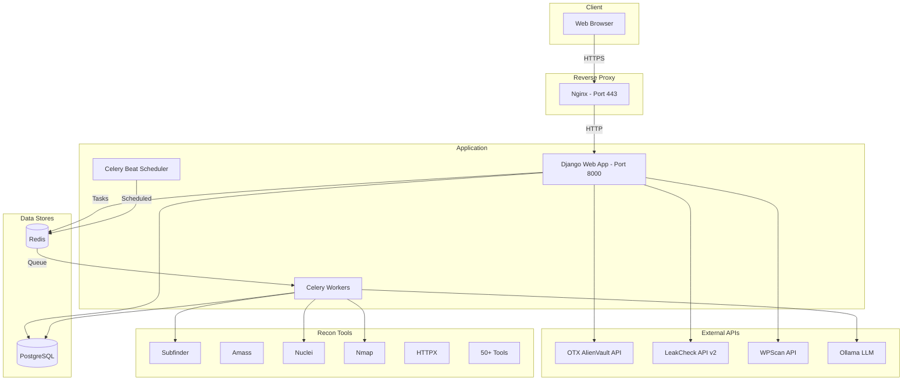
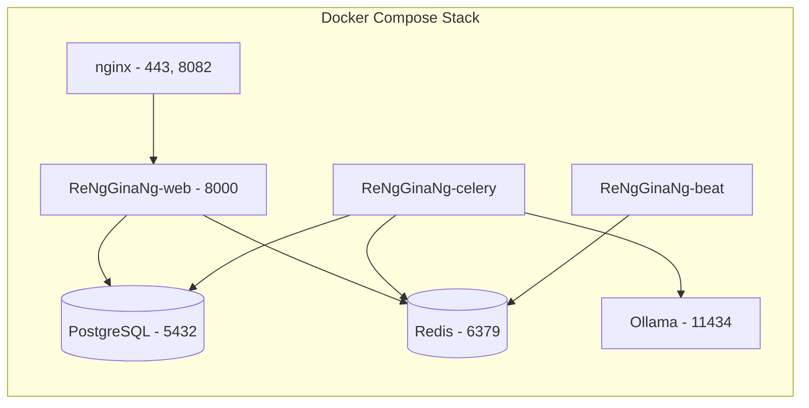
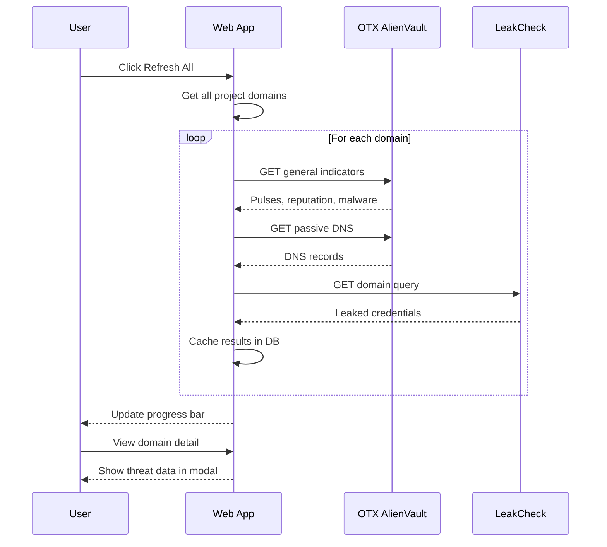
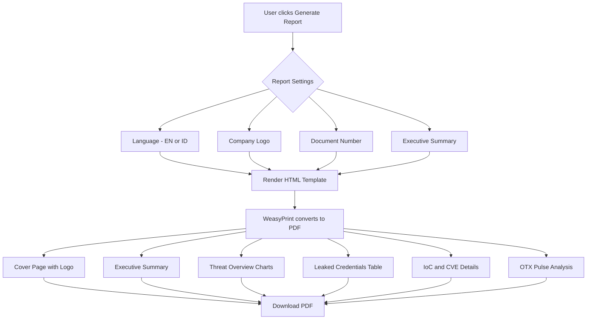
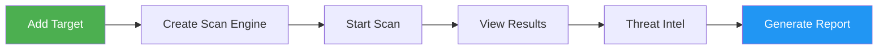
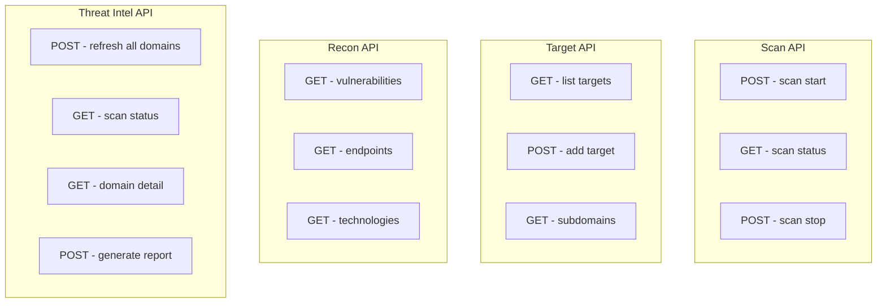

<p align="center">
  
</p>

<h3 align="center">Recon Engine for Global Guarding & Network Attack Intelligence</h3>

<p align="center">
  <strong>v1.0</strong> — A hardened, feature-enhanced fork of reNgine 2.2.0
</p>

<p align="center">
  <a href="#whats-new">What's New</a> &bull;
  <a href="#architecture">Architecture</a> &bull;
  <a href="#installation">Installation</a> &bull;
  <a href="#usage">Usage</a> &bull;
  <a href="#api-reference">API</a> &bull;
  <a href="#license">License</a>
</p>

---

## About

**ReNgGinaNg** is the next evolution of automated reconnaissance — built on top of [reNgine 2.2.0](https://github.com/yogeshojha/rengine) and redesigned for professional red team and blue team operations.

This release delivers a **Threat Intelligence module**, **bilingual PDF reporting (EN/ID)**, **dark web breach monitoring**, and a fully rebranded, telemetry-free experience.

### Key Highlights

- Fully self-hosted, zero telemetry, zero phone-home
- Threat Intel dashboard with OTX AlienVault & LeakCheck integration
- Bilingual vulnerability assessment PDF reports (English / Bahasa Indonesia)
- WPScan API integration for WordPress vulnerability scanning
- IoC, CVE, and credential leak analytics with charts
- Enhanced dashboard with threat intelligence overview
- Manual threat indicator management
- Configurable report settings (company logo, document number, executive summary)

---

## What's New

### vs reNgine 2.2.0

| Feature | reNgine 2.2.0 | ReNgGinaNg 1.0 |
|---------|---------------|-----------------|
| Threat Intelligence Page | - | OTX AlienVault + LeakCheck |
| Dark Web Breach Monitoring | - | Per-domain credential leak scanning |
| IoC / CVE Analytics | - | Tables + Donut/Bar charts |
| Bilingual PDF Reports | English only | English + Bahasa Indonesia |
| Report Customization | Basic | Company logo, doc number, exec summary |
| WPScan Integration | - | WordPress vulnerability scanning |
| Manual Threat Indicators | - | Add/manage indicators manually |
| Dashboard TI Overview | - | Pulse count, leak count, risk cards |
| Telemetry / Phone-Home | GitHub update check | Removed entirely |
| External Backlinks | Owner's GitHub/wiki | Removed entirely |
| Branding | reNgine / yogeshojha | ReNgGinaNg (fully independent) |

### New API Endpoints

| Endpoint | Method | Description |
|----------|--------|-------------|
| `/<slug>/threat-intel/` | GET | Threat intelligence dashboard |
| `/<slug>/threat-intel/refresh_all` | POST | Refresh all domains from OTX + LeakCheck |
| `/<slug>/threat-intel/refresh_domain/<id>` | POST | Refresh single domain |
| `/<slug>/threat-intel/scan_status` | GET | Polling endpoint for scan progress |
| `/<slug>/threat-intel/domain_detail/<id>` | GET | Full threat data for a domain |
| `/<slug>/threat-intel/manual-indicators/` | GET/POST | Manual indicator management |
| `/<slug>/threat-intel/generate-report/` | POST | Generate TI PDF report |
| `/<slug>/threat-intel/download-report/` | GET | Download generated PDF |
| `/<slug>/threat-intel/report-settings/` | GET/POST | Configure report settings |

---

## Architecture

### System Overview



### Docker Infrastructure



### Threat Intelligence Data Flow



### PDF Report Generation Flow



---

## Installation

### Prerequisites

- Linux server (Ubuntu 20.04+ / Debian 11+)
- Docker & Docker Compose v2
- Minimum 4 GB RAM, 2 CPU cores
- Open ports: 443 (HTTPS), 8082 (optional)

### Quick Install

```bash
# Clone the repository
git clone https://github.com/anggipradana/ReNgGinaNg.git
cd ReNgGinaNg

# Create environment file
cp .env.example .env

# Edit .env — CHANGE ALL PASSWORDS!
nano .env

# Run installation
sudo ./install.sh
```

### Manual Install (Step by Step)

#### 1. Clone & Configure

```bash
git clone https://github.com/anggipradana/ReNgGinaNg.git
cd ReNgGinaNg
cp .env.example .env
```

#### 2. Edit Environment Variables

```bash
nano .env
```

**Important**: Change these values:
- `AUTHORITY_PASSWORD` — SSL certificate password
- `POSTGRES_PASSWORD` — Database password (use a strong one)
- `DJANGO_SUPERUSER_USERNAME` — Admin username
- `DJANGO_SUPERUSER_PASSWORD` — Admin password (use a strong one)

#### 3. Generate SSL Certificates

```bash
make certs
```

#### 4. Build & Start

```bash
# Build Docker images
make build

# Start all services
make up
```

#### 5. Access the Application

Open your browser and navigate to:

```
https://your-server-ip
```

Login with the credentials from your `.env` file.

#### 6. Configure API Keys (Optional but Recommended)

Navigate to **Settings > API Vault** and add:

| API | Purpose | Get Key |
|-----|---------|---------|
| OTX AlienVault | Threat intelligence data | [otx.alienvault.com](https://otx.alienvault.com) |
| LeakCheck | Dark web breach data | [leakcheck.io](https://leakcheck.io) |
| WPScan | WordPress vulnerability scanning | [wpscan.com](https://wpscan.com) |
| OpenAI / Ollama | LLM-powered analysis | Local Ollama or OpenAI API |

### Docker Compose Commands

```bash
# Start services
make up

# Stop services
make stop

# View logs
make logs

# Rebuild after updates
make build && make up

# Run database migrations
docker compose exec web python3 manage.py migrate

# Create superuser manually
docker compose exec web python3 manage.py createsuperuser
```

---

## Usage

### Workflow Overview



### 1. Adding Targets

1. Click **Targets** in the navigation
2. Click **Add Target**
3. Enter the domain (e.g., `example.com`)
4. Optionally add description and organization
5. Click **Save**

### 2. Configuring Scan Engines

ReNgGinaNg comes with pre-configured scan engines:

| Engine | Description |
|--------|-------------|
| **ReNgGinaNg Recommended** | Full reconnaissance pipeline |
| **Full Scan** | All tools enabled, thorough scanning |
| **Subdomain Discovery** | Subdomain enumeration only |
| **OSINT** | Open-source intelligence gathering |
| **Vulnerability Scan** | Nuclei-based vulnerability scanning |

Custom engines can be created via **Scan Engine > Add Engine** using YAML configuration.

### 3. Running Scans

1. Go to **Dashboard**
2. Select a target domain
3. Choose a scan engine
4. Click **Start Scan**
5. Monitor progress in real-time

### 4. Threat Intelligence

1. Navigate to **Threat Intel** from the top menu
2. Ensure API keys are configured (Settings > API Vault)
3. Click **Refresh All** to scan all domains
4. View summary cards: Risk Score, Pulses, Malware, Leaks
5. Click the eye icon on any domain for detailed threat data
6. Add manual indicators via the **Manual Indicators** section

### 5. Generating Reports

#### Vulnerability Assessment Report
1. Go to **Dashboard**
2. Click **Generate VA Report**
3. Select language (English / Bahasa Indonesia)
4. Download PDF

#### Threat Intelligence Report
1. Go to **Threat Intel**
2. Configure report settings (logo, document number, executive summary)
3. Click **Generate Report**
4. Download PDF

---

## API Reference

### Authentication

All API endpoints require session authentication. Login via the web interface first.

### Endpoints Overview



### Scan Operations

| Method | Endpoint | Description |
|--------|----------|-------------|
| POST | `/api/scan/start/<target_id>/` | Start a new scan |
| GET | `/api/scan/status/<scan_id>/` | Get scan status |
| POST | `/api/scan/stop/<scan_id>/` | Stop running scan |
| GET | `/api/listScanHistory/` | List all scan history |

### Reconnaissance Data

| Method | Endpoint | Description |
|--------|----------|-------------|
| GET | `/api/querySubdomains/` | Query discovered subdomains |
| GET | `/api/queryEndpoints/` | Query discovered endpoints |
| GET | `/api/queryVulnerabilities/` | Query found vulnerabilities |
| GET | `/api/listTechnologies/` | List detected technologies |
| GET | `/api/listPorts/` | List discovered ports |
| GET | `/api/listIPs/` | List discovered IP addresses |

### Threat Intelligence

| Method | Endpoint | Description |
|--------|----------|-------------|
| POST | `/<slug>/threat-intel/refresh_all` | Refresh all domain threat data |
| POST | `/<slug>/threat-intel/refresh_domain/<id>` | Refresh single domain |
| GET | `/<slug>/threat-intel/scan_status` | Get refresh progress |
| GET | `/<slug>/threat-intel/domain_detail/<id>` | Get full threat detail |
| POST | `/<slug>/threat-intel/manual-indicators/` | Add manual indicator |
| POST | `/<slug>/threat-intel/generate-report/` | Generate TI report |
| GET | `/<slug>/threat-intel/download-report/` | Download TI report PDF |

---

## Project Structure

```
ReNgGinaNg/
├── config/
│   └── nginx/              # Nginx reverse proxy config
├── docs/
│   └── images/             # Logo and documentation images
├── scripts/                # Utility scripts
├── web/
│   ├── ReNgGinaNg/         # Django project (settings, celery, tasks)
│   ├── api/                # REST API views and serializers
│   ├── dashboard/          # Main dashboard app
│   ├── scanEngine/         # Scan engine configuration
│   ├── startScan/          # Scan execution and history
│   ├── targetApp/          # Target management
│   ├── threatIntel/        # Threat Intelligence module (NEW)
│   ├── static/             # CSS, JS, images
│   ├── templates/          # Shared templates, reports
│   └── fixtures/           # Default scan engines, tools
├── docker-compose.yml
├── Makefile
├── install.sh
└── .env.example
```

---

## Troubleshooting

### Common Issues

**Cannot access the web interface**
```bash
# Check if all containers are running
docker compose ps

# Check web container logs
docker compose logs web

# Restart all services
make stop && make up
```

**Database migration errors**
```bash
docker compose exec web python3 manage.py migrate
```

**Static files not loading**
```bash
docker compose exec web python3 manage.py collectstatic --noinput
```

**Celery workers not processing tasks**
```bash
# Check celery logs
docker compose logs celery

# Restart celery
docker compose restart celery
```

---

## Credits

ReNgGinaNg is built upon the excellent foundation of [reNgine](https://github.com/yogeshojha/rengine) by Yogesh Ojha. We extend our gratitude to the original author and all contributors.

This fork includes significant enhancements for professional security operations while maintaining full compatibility with the original reconnaissance engine.

---

## License

Distributed under the GNU General Public License v3.0. See `LICENSE` for more information.
